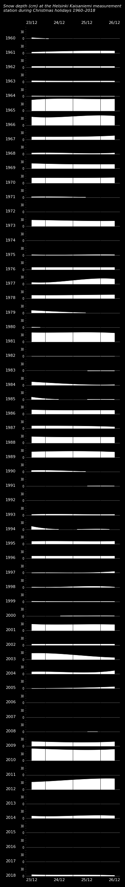
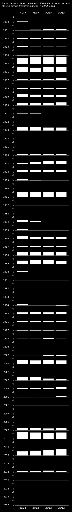

# Kaisaniemi Christmas Holiday snow depth grapghic
Snow depth graphic from Finnish Meteorological institute data, created with [Matplotlib](https://matplotlib.org/3.1.1/index.html) and [Pandas](https://pandas.pydata.org/). 
Provided as is as python file + csv and Jupyter notebook.

Data source: https://en.ilmatieteenlaitos.fi/download-observations#!/

By Jonatan Hildén https://creativecommons.org/licenses/by/4.0/

